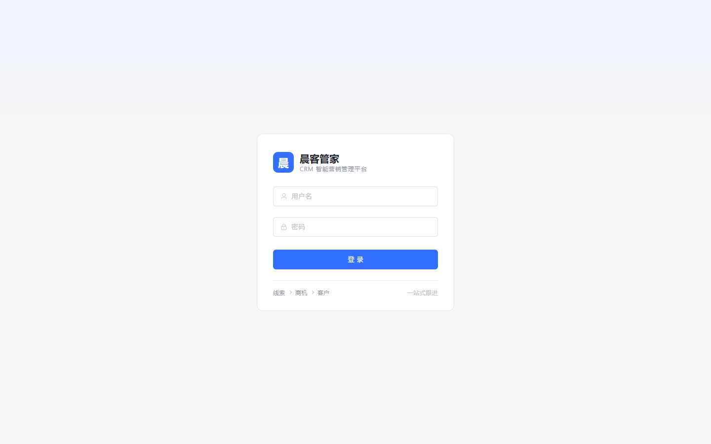
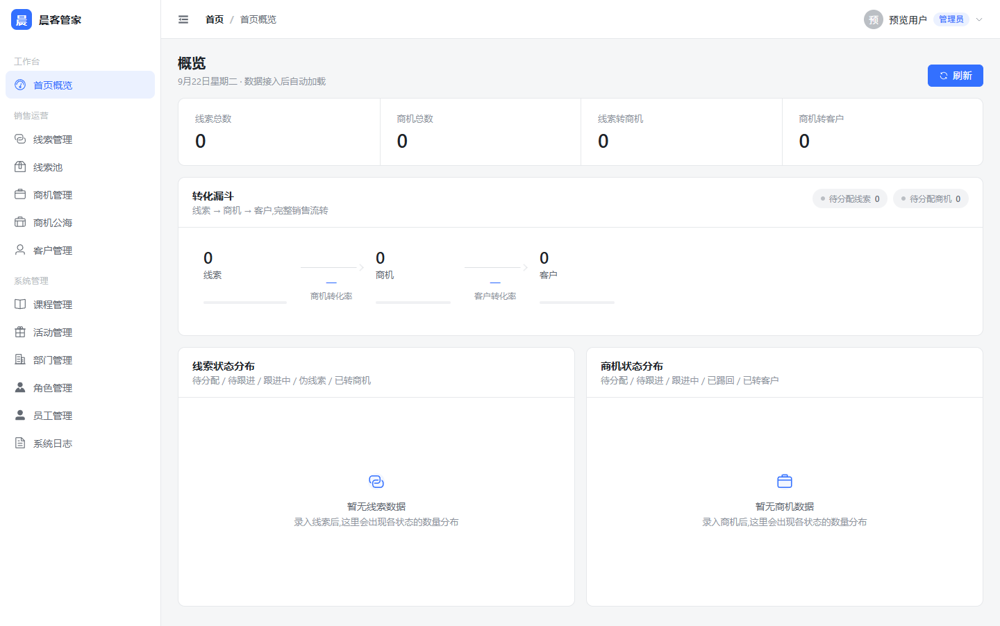
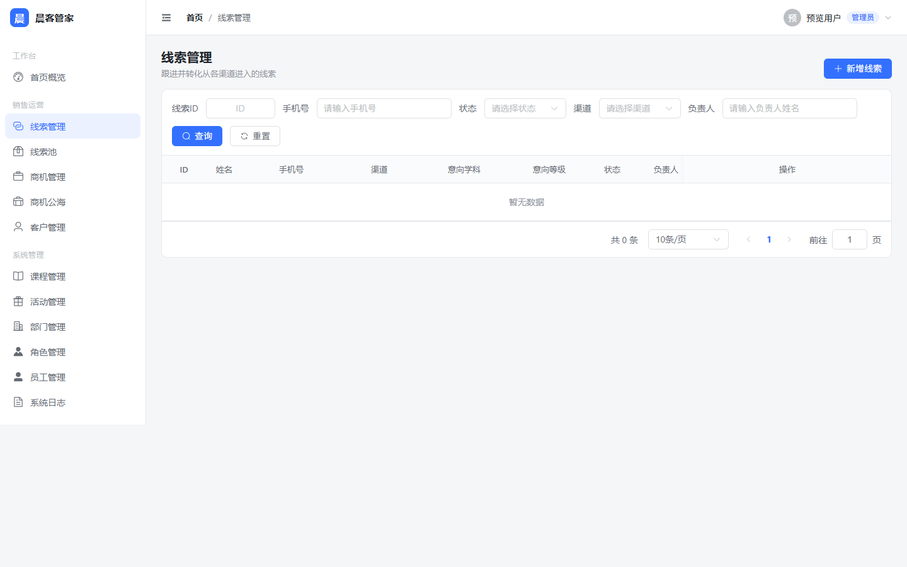
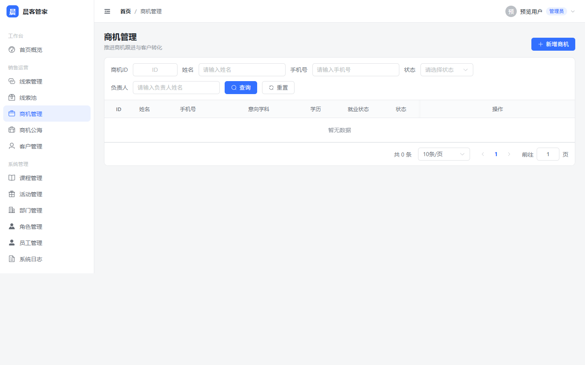
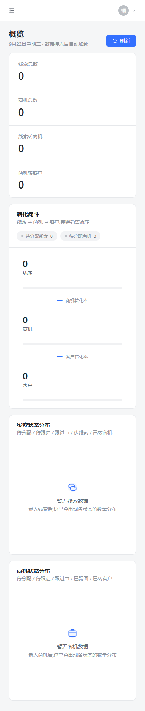

# 晨客管家 - 前端

面向 IT 职业培训机构的 CRM 管理端,覆盖「渠道线索 → 商机 → 缴费客户」的完整销售漏斗,含线索池 / 商机公海分单机制、按学科与课程的跟进维度、活动与折扣管理。

技术栈:Vue 3 + TypeScript + Vite + Element Plus + ECharts + Pinia + Vue Router

## 界面预览

> 以下截图**未连接后端**,呈现的是空态与骨架态——本项目按「空态即设计」的原则处理无数据场景,不伪造演示数据。

|                登录                 |                  概览                   |
| :---------------------------------: | :-------------------------------------: |
|  |  |

|                线索管理                |                  商机管理                  |
| :------------------------------------: | :----------------------------------------: |
|  |  |

|                      移动端(390 × 844)                       |
| :----------------------------------------------------------: |
|  |

## 功能模块

12 个功能路由,菜单按角色过滤:

| 分组     | 模块                                                       |
| -------- | ---------------------------------------------------------- |
| 工作台   | 首页概览                                                   |
| 销售运营 | 线索管理、线索池、商机管理、商机公海、客户管理             |
| 系统管理 | 课程管理、活动管理、部门管理、角色管理、员工管理、系统日志 |

- `admin` 角色可见全部菜单(含课程/活动/部门/角色/员工/日志)。
- 其他角色仅可见:首页概览、线索、线索池、商机、商机公海、客户。

## 本地开发

```bash
npm install
npm run dev
```

- 访问 http://localhost:5173
- 开发环境下 `/api/*` 请求会被 Vite 代理到 `http://localhost:8080`(后端 qk-parent 服务),需先启动后端。

## 生产部署(Docker)

```bash
docker build -t chenke-butler-web .
docker run -d -p 80:80 --name chenke-butler-web --network <后端所在docker网络> chenke-butler-web
```

- 容器内 Nginx 将 `/api/*` 反向代理到 `http://backend:8080/*`。
- 若后端不在同一 Docker 网络,请修改 `nginx.conf` 中 `proxy_pass` 为后端实际地址。

## 按字典调整码值

接口文档未提供字典表,以下码值按通用约定整理在 `src/dict/index.ts`,如与后端不一致只需改这一个文件:

性别、启用状态、渠道、学科、意向等级、学历、就业状态、线索/商机状态、活动类型、伪线索原因、跟进状态、关键信息。

## 重新生成截图

```bash
npm run build
npm run preview -- --port 5180 --strictPort

# 另开一个终端
node scripts/shoot.mjs
```

截图脚本用无头浏览器拦截 `/api/*` 注入空数据,输出到 `.impeccable/review/`,挑选后放入 `docs/screenshots/`。
